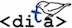

# Technical Writing (Virtual Classroom) Instructor Handbook

Handbook for instructors (with oddly-shaped hands) of ENGL 3764: *Technical Writing* at Virginia Tech.

A web version of this handbook is located at <http://www.faculty.english.vt.edu/3764>

## Credits:
- Written by Kevin Lewis
- Edits and annoying comments by Carlos Evia (cevia@vt.edu)

**DITA is good for you** 

 This work is licensed under a <a rel="license" href="http://creativecommons.org/licenses/by-nc-sa/4.0/">Creative Commons Attribution-NonCommercial-ShareAlike 4.0 International License</a>.
